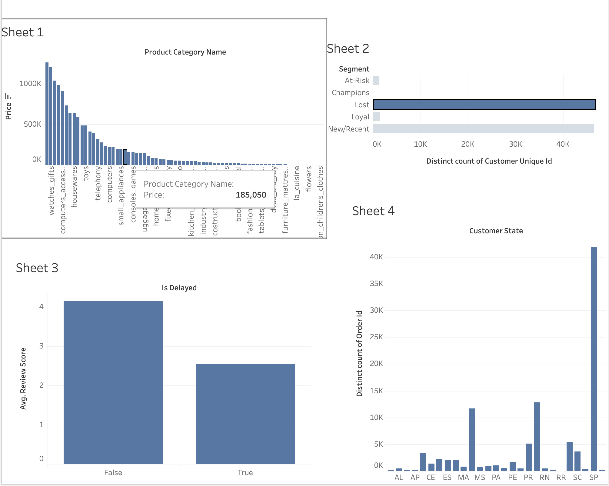

# Olist E-Commerce Customer & Operations Analytics


## 📌 The Business Problem
Olist is a major Brazilian e-commerce marketplace. This project acts as an end-to-end data analytics pipeline designed to answer two critical business questions:
1. **Why are customers not returning?** (Customer Retention & Churn)
2. **What operational bottlenecks are hurting revenue and satisfaction?** (Logistics & Delivery Performance)

By analyzing over 100,000 orders across 9 relational tables, this project uncovers actionable insights to drive re-engagement campaigns and regional logistics audits.

---

## 📊 Interactive Tableau Dashboard
**[View the Live Interactive Dashboard on Tableau Public ↗](https://public.tableau.com/authoring/manavbhullar/Dashboard1#1)**

*(Note: Ensure your dashboard screenshot is saved as `dashboard.png` in the `assets/` folder)*


---

## 🚀 Key Insights & Business Recommendations

Based on the data visualizations and SQL analysis, we identified several major opportunities for Olist:

1. **Massive Churn in the Customer Base:** 
   Our RFM (Recency, Frequency, Monetary) segmentation revealed that the vast majority of the customer base falls into the **"Lost"** (~45,000 customers) and **"New/Recent"** (~45,000 customers) segments. 
   - **Recommendation:** Deploy an aggressive email re-engagement campaign offering free shipping specifically targeting the "Lost" and "At-Risk" segments to win back historically frequent buyers.

2. **Delivery Delays Destroy Customer Satisfaction:** 
   Delivery delays are severely punishing Olist's brand perception. Orders that arrive on time maintain an average review score of **~4.1 out of 5**. However, when an order is delayed, the average score plummets to **~2.5 out of 5**.
   - **Recommendation:** Implement stricter SLA tracking for sellers and flag items with high delay probabilities before checkout.

3. **Logistics Audit Needed in São Paulo (SP):** 
   The state of São Paulo (SP) completely dominates the platform's order volume, accounting for over 40,000 orders—vastly outperforming the next closest states (RJ and MG). Because SP carries so much volume, any delays here disproportionately hurt overall revenue.
   - **Recommendation:** We highly recommend a regional logistics and carrier routing audit specifically for the SP fulfillment nodes to protect the core customer base.

4. **Top Revenue Drivers:** 
   The top-performing product categories driving Gross Merchandise Value (GMV) are **Health & Beauty**, **Watches & Gifts**, and **Bed Bath & Table**. 

---

## 🛠️ Technical Implementation

### Data Pipeline & Stack
- **Python (Pandas & NumPy):** Loaded and merged 9 uncleaned relational Kaggle tables. Handled missing values, parsed datetimes, engineered operational delay features, and calculated RFM metrics.
- **DuckDB (SQL):** Used DuckDB's high-performance, in-memory SQL engine to run aggregations (Month-over-Month growth, Average Order Value, Seller rankings) directly against the processed Pandas dataframes.
- **Tableau Public:** Built a clean, interactive dashboard consuming a highly optimized, trimmed CSV export.

### Repository Structure
```text
olist-ecommerce-analytics/
├── data/
│   ├── raw/                 # Raw Kaggle CSVs (ignored by git)
│   └── processed/           # Cleaned tableau_export.csv
├── notebooks/
│   ├── 01_data_cleaning.ipynb
│   ├── 02_rfm_analysis.ipynb
│   ├── 03_operational_analysis.ipynb
│   ├── 04_revenue_sql_analysis.ipynb
│   └── 05_final_export_and_eda.ipynb
├── README.md
└── requirements.txt
```

---

## 💼 Resume Bullets

If you are a recruiter or hiring manager, here are the core technical achievements demonstrated by this codebase:

- **Performed RFM segmentation on 100K+ customer records**, identifying 4 core behavioral cohorts (Champions, Loyal, At-Risk, Lost) to guide targeted re-engagement campaigns for ~45,000 churned users.
- **Quantified delivery delay impact on retention**, proving that delayed orders scored 39% lower (2.5 vs 4.1) on customer reviews through Python data modeling.
- **Wrote multi-table SQL aggregations across 9 relational tables** using DuckDB to derive month-over-month revenue growth, average order values (AOV) by state, and seller performance KPIs.
- **Designed an interactive Tableau dashboard** highlighting top-performing product categories (Health & Beauty, Watches) and regional bottlenecks in São Paulo (SP).
